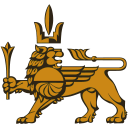

# Yerevan Drive Tools
  
Tools for modding **Yerevan Drive**.  
Textures, sounds, parameters, etc.

## Installation
- With Python, install requirements and run GUI.py **(recommended)**
- Or download builded .exe from [releases page](https://github.com/MillKeny/yerevandrive/releases "releases page") 

## TODO
- [x] **Textures** (.tex, .atx)
	- [x] Understanding structure
	- [x] Viewing
	- [x] Extracting
	- [x] Converting
	- [x] Replacing
- [x] **Sounds** (.snd)
	- [x] Understanding structure
	- [x] Viewing
	- [x] Extracting
	- [x] Replacing
- [x] **Strings and settings** (.ini)
	- [x] Viewing
	- [x] Codec conversion
	- [x] Changing
- [x] **Cars Parameters Manipulating** (.par)
	- [ ] Understanding structure (some done)
	- [ ] Cars' characteristics (some done)
	- [x] Wheels
	- [x] Change cars appearance
- [x] **Race Tracks** (.trc)
	- [ ] Understanding structure
	- [x] Specific Track Selector
- [ ] **.REF** (3D Models, Material Info, etc..?)
	- [ ] Understanding structure